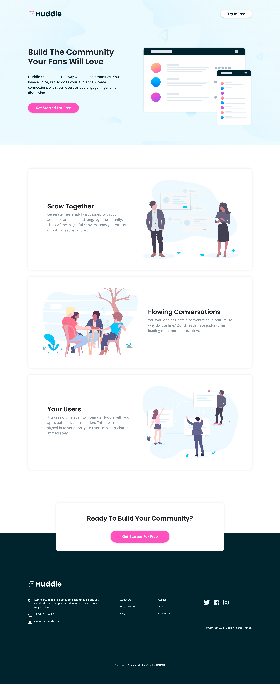
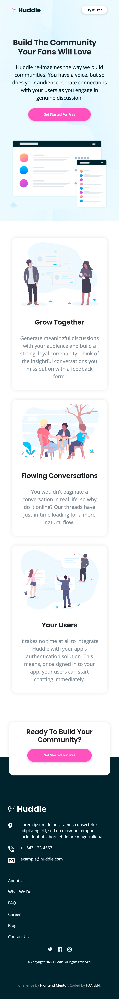

# Frontend Mentor - Huddle landing page with alternating feature blocks solution

This is a solution to the [Huddle landing page with alternating feature blocks challenge on Frontend Mentor](https://www.frontendmentor.io/challenges/huddle-landing-page-with-alternating-feature-blocks-5ca5f5981e82137ec91a5100). Frontend Mentor challenges help you improve your coding skills by building realistic projects.

## Table of contents

- [Overview](#overview)
  - [The challenge](#the-challenge)
  - [Screenshot](#screenshot)
  - [Links](#links)
- [My process](#my-process)
  - [Built with](#built-with)
  - [What I learned](#what-i-learned)
  - [Continued development](#continued-development)
- [Author](#author)

## Overview

I’m a full-stack developer in the progress, and I just finished learning HTML, CSS, and Bootstrap, and I wanted to practice what I have learned so far before moving to the next step. I was thinking of mimicking existing websites OR searching on Bribbble and finding a design to code, but then I found the Frontend Mentor platform and I couldn’t ask for more!
This challenge is a great opportunity for me to practice writing HTML and CSS code.

### The challenge

Users should be able to:

- View the optimal layout for the site depending on their device's screen size
- See hover states for all interactive elements on the page

### Screenshot

This screenshot is for the desktop design


And this screenshot is for the mobile design


### Links

- Solution URL: [Add solution URL here](https://your-solution-url.com)
- Live Site URL: [Add live site URL here](https://your-live-site-url.com)

## My process

My workflow was as follows:
I divided the page into 3 sections (top, middle, and bottom), then I started coding from the top, and once I finish a section for the desktop screen size, I make it responsive for mobile size too.

### Built with

- Semantic HTML5 markup
- CSS custom properties
- Bootstrap

### What I learned

- I learned how to reverse items in a container, I needed that when I was trying to make the design responsive for mobile screen sizes.

```css
.reverse {
  display: flex;
  flex-direction: column-reverse;
}
```

- I learned how to change SVG element color.

```css
.bottom-section .logo {
  filter: brightness(0) invert(1);
}
```

### Continued development

I’m planning to learn about CSS Grid and Flexbox, and I might come back to this challenge and use these concepts.

## Author

- Frontend Mentor - [@HaneenG7](https://www.frontendmentor.io/profile/HaneenG7)
- Twitter - [@HaneenG75](https://twitter.com/HaneenG75)
- LinkedIn - [@haneen-alghamdi7](https://www.linkedin.com/in/haneen-alghamdi7)
